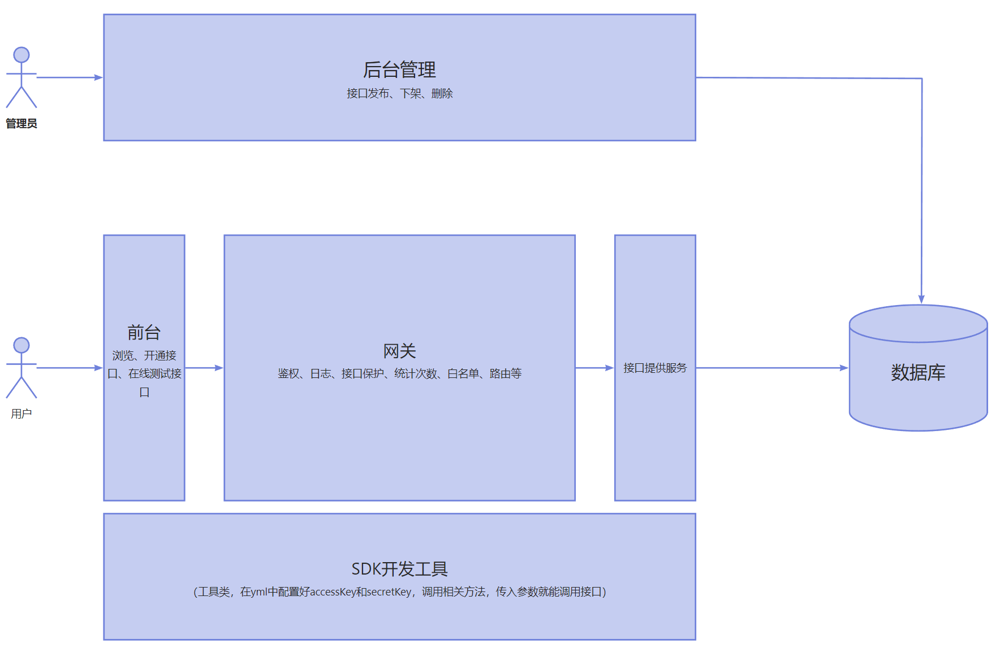

# 【你好API共享平台】

## 项目介绍
这是一个API接口调用平台，帮助企业、个人统一开放接口，为业务高效赋能

* 管理员：发布、上线接口以及新增接口

* 用户：登录注册、开通和在线测试接口，还能使用SDK高效使用接口

项目架构图：

项目目录：

* api-client-sdk：SDK工具
* api-common：公共接口抽取到这里（网关和apiplatform-backend都引入这个包，apiplatform-backend提供实现，网关去使用）
* api-gateway:网关
* api-interface：接口提供服务
* apiplatform-backend:后台管理

## 技术选型：
* Spring Boot
* MyBatis-Plus
* Spring Boot starter(SDK)
* Spring Cloud Gateway(网关)
* Nacos(注册中心)
* Dubbo(RPC)